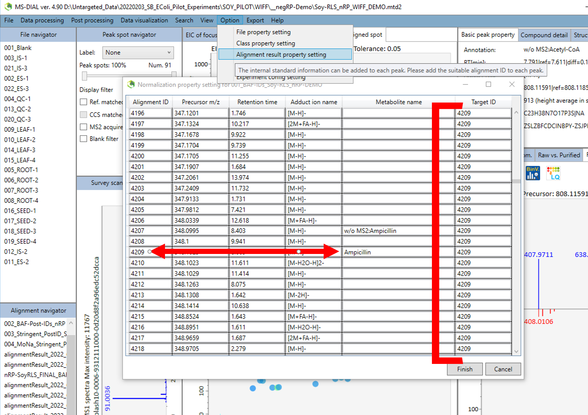
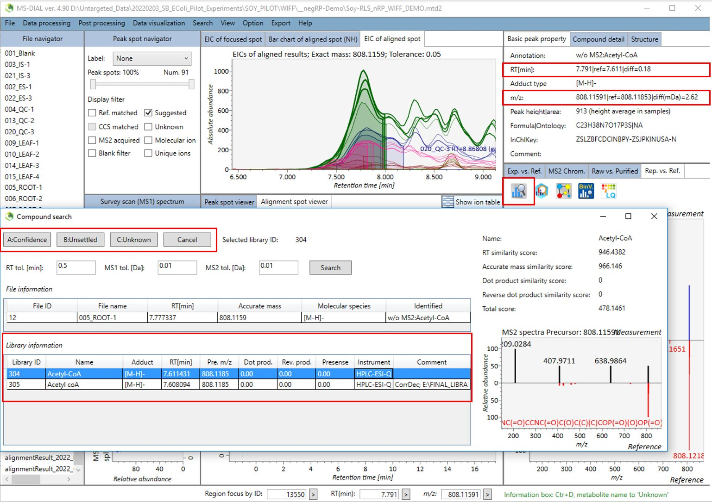
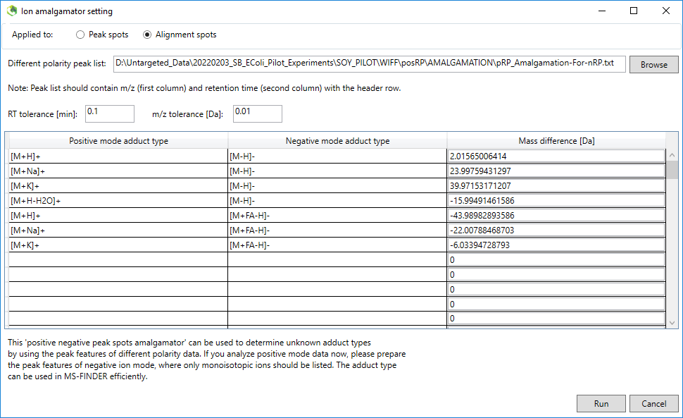

The data set is acquired by SWATH acquisition, a type of Data Independent Acquisition (DIA acquisition). The spectra acquired by DIA acquisition, as opposed to DDA acquisition (such as MRM or an IDA experiment), are very rich in information but require deconvolution. This is because the link between Precursor Ion (MS1) and Product Ion (MS2) is lost in DIA acquisition. This means that the MS2 scan of two co-eluting compounds within the same MS2 experiment (as in the same SWATH window) are identical.

# Sample Processing in MS-DIAL GUI

## Introduction

Described here is a step-by-step for processing an HPLC-ESI-QTOF untargeted metabolomics data set acquired with the BAF's Sciex TripleTOF 6600 high-resolution mass spectrometer, coupled to an ExionLC HPLC system, using the MS-DIAL (v 4.90) GUI program . This data set has been acquired by SWATH acquisition, a type of Data Independent Acquisition (DIA acquisition), and the data set contains sample files from four separate runs (aka "modes"):

1.  Reverse-phase negative mode (nRP, negRP, etc.)
2.  Reverse-phase positive mode (pRP, posRP)
3.  HILIC negative mode (nHILIC, negHILIC)
4.  HILIC positive mode (pHILIC, posHILIC)

All attempts will be made to follow the confidence reporting guidelines set forth by the Metabolomics Standards Initiative (MSI). For compound identification, an in-house Accurate Mass-Retention Time spectral (AMRT + MS2) library is used for MSI Level-1A compound annotations. An additional, curated spectral MS2 library from MassBank of North America (MoNa) is used too.

In this tutorial, the samples are `*.wiff` files. The spectra in the native `*.wiff` files are profile spectra, as opposed to centroided spectra. These files could have also been converted to another format, such as `*.mzML`. In particular, to use the MS-DIAL command-line tool, MsdialConsoleApp.exe, DIA files must be converted to `*.abf` format. There are advantages to this file format even if the GUI program is being used: `*.abf` is a binary file format, so these files process very quickly.

## Steps

#### Preparation

1.  Make a directory for your project on your computer or hard drive. Set up sub-directories for the four modes mentioned above (pRP, nRP, pHILIC, nHILIC).
2.  Copy all `*.wiff` and `*.wiff.scan` files from the instrument PC to your project directory. Sort the `*.wiff` and `*.wiff.scan` files to the correct sub-directory.
    -   NOTE: Delete files that you are not using (such as those that were re-ran). Each sub-directory should have the exact same number of `*.wiff` and `*.wiff.scan` files corresponding to the exact same samples (this includes blanks, QCs, IS, etc.
3.  For whatever version you are using (v4.90 here), copy the MS-DIAL application folder into each of the four sub-directories. On the data processing computer this folder can be found at this path: `D:\MSDIAL ver.4.90 Windows`
4.  Copy the BAF spectral library (`*.msp` file) for each mode, as well as the MoNa spectral library (positive and negative only) into the appropriate sub-directories.
5.  Copy (or make) the tab-delimited `*.txt` DIA Experiment File (aka "swath-dictionary.txt") to each sub-directory.
6.  Copy (or make) the tab-delimited `*.txt` Retention-Time Correction File (aka "tIS.txt") for each mode into the appropriate sub-directory.
7.  Add the MS-DIAL parameter (`*.txt` and `*.med2`) files to each sub-directory. For every mode, there should be:
    -   A `*.txt` file for BAF-Library-Processing settings (example: `Parameter_nRP-BAF.txt`)
    -   A `*.med2` file that can be loaded into MSDIAL for BAF-Library-Processing settings (example: `Parameter_nRP-BAF.med2`)
    -   A `*.txt` file for MoNa-Library-Processing settings (example: `Parameter_nRP-MoNa.txt`)
    -   A `*.med2` file that can be loaded into MSDIAL for MoNa-Library-Processing settings (example: `Parameter_nRP-MoNa.med2`)
8.  An Excel/`*.csv` file containing sample names (MUST BE THE SAME ACROSS ALL MODES; sample names does not mean `*.wiff` file names..), "Type" (sample, standard, QC, etc), Class ID (cohort name), Batch (usually 1 for all, unless not all ran together), Analytical order (sort `*.wiff` files by date to determine), Inject. Volume (uL), Included (TRUE or FALSE; usually true initially but we change to false later).
9.  For each run, a post-identification tab-delimited `*.txt` file must be made and saved to each directory. This file should have these columns in the order given: `Metabolite`, `MZ`, `RT`, `Adduct`, `InChiKey,` and `SMILES`. Only include compounds that can be detected in a given mode (NOTE: detected is not the same as MS2 acquisition or a good signal...). See below for polarity-specific adducts to include.
    -   Positive mode: Include [M+H]-, [M+Na]+, [M+K]+, [M+H-H2O]+, [M+H-2H2O]+, and [2M+H]+
    -   Negative mode: Include [M-H]-, [M-H+FA]-, and [2M-H]-

#### Creating the MS-DIAL Project

1.  Navigate to the sub-directory for one of the four modes, then click on the MSDIAL folder and open up `MSDIAL.exe`. For the sake of the demo, we are using negRP first.
2.  Click `File > New Project`
3.  Set the project directory to the sub-directory containing the `*.wiff` files. In the text box containing the path of the directory, change the default project name to a more descriptive one. The name of the project will be the
4.  Add the SWATH experiment `*.txt` file.
5.  **Select the correct ionization/polarity**
6.  Click `Next`
7.  Add sample data files to the analysis. **Make sure to display the correct file type, as in change the file type to `*.wiff` from `*.abf`**. For every file you load, there should be a "sister" file for all of the other modes that has the same analytical order.
8.  Open the spreadsheet containing the sample info and copy it into the sample info dialogue box. Make sure that the name of the sample (not the file name itself) is the same in all of the different modes. Also make sure that you have copied the sample info from the spreadsheet to the correct file in MS-DIAL. Once satisfactory, click `Next`.
9.  Load the MS-DIAL method/parameter `*.med2` file that should be in the project's directory by clicking `Load`. We will be processing with two different settings, so first load the BAF settings.
10. Once the parameters load, navigate to the `MS2Dec` tab, and under "Advanced", make sure that **Exclude after precursor ion is checked**, and **Keep the isotopic ions w/o MSDec is unchecked**.
11. Navigate to the `Identification` tab of the parameter setting window. Select the `*.msp` library you wish to use for spectral identification. Then, load the tab-delimited text file that you wish to use for AMRT post-identification. Note: There are different settings for using the BAF in-house MSP file versus using the MoNa MSP file, mainly because the BAF's has RT information that can be used for filtering candidates. A less stringent setting for the score can be used for the BAF's library because of the RT info.
12. Navigate to the `Alignment` tab of the parameter window, and select the QC sample that is in the middle of the analytical order for the reference file. Make sure to also name the alignment, so that you can keep track of your results better.
13. Once you are done with the parameters window, click `Next`.
14. The RTcorrection window should open after a bit. Click `Browse Ref file` to select the RTcorr.txt file for retention-time correction using the technical internal standards.
15. Click `RT correction` to begin detection of internal standards for assessing RT drift. This will take a couple of minutes.
16. Once loading is complete, click the `Result table` tab to make sure the internal standards were detected in every sample (except the blank).
17. If something wasn't detected in a sample, the associated cell in the table will be orange. Click `Auto fill` to fill the missing value with the average retention time. Make sure to do this for the blank. If necessary, determine why an IS was not detected in a sample. Sometimes you can fix the issue by navigating back to the `Reference compound information` tab and modifying the RT and m/z tolerances and repeating this step.
18. Review the intensity plots and uncorrected/corrected EIC tabs. Click `Run` once everything is satisfactory, and samples will finish processing.
19. Either at this point, or at a more convenient time later, perform steps #1-#18 for the other three modes.

#### Data visualization and curation

1.  Once the project file has loaded, click through all of the sample files displayed in the `File Navigator` to make sure that all of the samples were processed correctly. This is especially important when using `*.abf` and `*.mzML` files. Looking at the `Peak spot viewer`, make sure the retention time and mass range is not cut short.

2.  Double-click an alignment file under the `Alignment navigator`. This will switch the `Peak spot viewer` to the `Alignment spot viewer`.

3.  Check "Ref. matched" and "Blank filter" under the `Peak spot navigator`. This filters the spots displayed in the `Alignment spot viewer` to features that matched the BAF library and have a higher intensity than the blank (blank filtering must be checked in the parameters).

4.  Click `Show ion table`, and search for the internal standards. We are looking for one that is to be used for normalization. Knowing this, the one chosen should have similar intensities across the samples within each cohort, but also across the different cohorts (the IS should not have a much higher intensity than the samples). Ampicillin is ideal for the reverse-phase mode because it ionizes well in both polarities, so the same compound can be used for normalization of both runs.

5.  Once the IS has been found in the peak table, note the alignment ID of the feature (the first column in the table).

6.  Click `Option > Alignment result property setting` in the menu bar at the top of the window.

7.  In the first entry of the table that appears, type the alginemnt ID of the IS into the `Target ID` column. Copy and paste this to every entry in the table. There are probably 10,000-20,000 rows, so it is easiest to copy the value, click into the 2nd row, scroll all the way to the bottom, shift+click into the last row, and paste using `Ctrl+V`. Click `Finish` when you are done.

    {width="762"}

8.  Click `Data visualization > Normalization` in the menu bar at the top of the window.

9.  Select "Internal standard + LOWESS" in the options. Click `Span opt` then `Done`.The LOWESS regression is very robust, even without IS, but it does require *at least* two QC samples. **NOTE: There is not a way to normalize by sample mass, so make sure to weigh out the same amount when performing sample prep.**

10. Click `Option > File property setting` in the menu bar at the top of the window.

11. Under the `Included` column of the table that opens, uncheck everything that is not in one of the sample cohorts (including the Blank, QC and IS samples). Click `Finish` when you are done, and click a different spot or table feature to update your changes in the `Bar chart of aligned spot` window.

12. Next to the bar charts displaying the samples intensities by cohort, click the `EIC of aligned spot` tab to display the aligned Extracted Ion Chromatograms (EIC). The alignment can be modified by `Right click > Aligned chromatogram viewer for...` and within this window you can also integrate all the sample peaks simultaneously. Individual sample peaks can be integrated by `Right click > Table viewer for curating each chromatogram`.

13. Making sure you are still working under the `Alignment spot viewer`, display the ion table by clicking `Show ion table`. Sort the table by `Metabolite name` by clicking the column header. Sorting by name makes it easier to spot misaligned peaks that resulted in two entries for the same feature. Be careful and pay attention to adduct and m/z... do not mistake features with the same name but different adducts for duplicated features due to misalignment.

14. Sort through each of the matched features and check that the integration is good. When necessary, adjust the integration as described in step #13. In the special case of a duplicate feature due to misalignment (described above), first realign and integrate the feature that is mostly correct (usually all but one sample peak will be integrated). Then, find the duplicated feature containing integrated peaks that were not integrated in the other feature entry. Un-integrate these using the `Aligned chromatogram viewer...` by right-clicking the middle pane in an area where there is no peak, then clicking `Update`. Close the pop-up window, and then change the identification to "Unknown" using the `Compound search` tool (it is the icon with a magnifying glass above the spectrum display window; see the image below step #16 for help). Now, there should only be one identified feature that is properly integrated.

15. Continue with curation of the identified peaks. Make sure to pay attention to the RT diff and m/z diff in the `Basic peak property` tab of the compound meta data (upper right corner). When these values are too high, it indicates mis-identification. Use the `Compound search` tool to change the library match if necessary.

16. Now, check the "Suggested" box in the `Peak spot navigator` to review matches that correspond to the lower confidence level IDs. These will appear in the ion table as "w/o MS2: [Compound]". This step in particular will help increase the number of matches, especially those with low intensity. Use the `Compound search` tool to do one of the following:

    -   Change to "Confident" if the suggested match has a low RT difference and low m/z difference.
    -   Change to "Unknown" if the feature is not a true peak, or something that you do not think belongs in the final results.
    -   Change to "Unsettled" if the spectral match is good and there is a low m/z difference, but based on RT info (or if there is a better identification) it can be excluded. This might indicate that the match is an isomer of the compound in the library within the same compound class.
    -   Additional library entries can be searched using the `Search` tool. RT and m/z tolerances can be adjusted.

    

17. Click `File > Save` to save the project after your curations.

18. **For the amalgamation of positive and negative modes**, an alignment feature table must be exported for use with the project of opposite polarity and same column. This will not be the final feature export. Go ahead and click `Export > Alignment result`. Export the normalized results. It says that `*.msp` and `*.mgf` are the only formats, but a `*.txt` file is actually what is exported. Set the directory to export the "results" to and click export.

19. Open up the exported table. Delete all the columns except for the Average RT and Average m/z. Move the m/z so that is the first column, and the RT is the second. Name the column headers `m/z` and `retention time`. Save the file as a tab-delimited `*.txt` file. If you saved to a different name, go ahead and delete the original file that was exported as these are not the final results.

20. Repeat all the steps for "**Creating the MS-DIAL Project"** and steps #1-#19 of "**Data visualization and curation**" to create a project for and curate the results of the opposite polarity and same column (for example, if you were processing data for negRP, process data for posRP).

21. In the posRP project file, click `Post processing > Amalgamation of different polarity peak list` in the menu bar at the top of the window.

22. Adjust the settings to reflect the image below. This will be the same for both modes and both columns.

23. Press `Run`. If it doesn't work, MS-DIAL will crash and this likely means there is formatting issues with the peak list file that was uploaded. If it does work, it won't really look like much has happened, but some features will be annotated with the adduct they are correlated with in the other polarity.
24. Save the project, then press `Export > Alignment result` and export the normalized results, and also the parameters. Saving these parameters will make it easy to report the settings used and it will also make setting the parameters of future projects easier.
25. Open up the Windows File Explorer application to the directory you exported the results. Change the name of the two parameter files and the results file to a name that is descriptive of the samples, the reference library used, and the analytical mode. If you would like, open the results file with Excel to view.
26. Repeat steps #21-#25 for the negRP project file. The remaining steps in this section should be completed if you wish to process with the MoNa spectral library in addition to the BAF spectral library that we have already processed with. Do note, however, that there is not yet a good way of combining the two exported results files with the different library matches.
27. Click `Data processing > Identification` on the menu bar at the top of the window. Select the MoNa `*.msp` file for the associated mode. Change the RT tolerance to 100 min, the Identification score cut off to 80%, and make sure Use RT for scoring and Use RT for filtering are both unchecked. Continue using the same post-identification settings. Click `Finish`.
28. With a couple of exceptions, repeat steps #2-#26 of this section using the new alignment file containing the MoNa matches. I recommend skipping step #16 with the "Suggested" features because there will be too many. Use the Compound Search tool to pick the best matches of the identified compounds.

#### Statistical analysis

1.  With an MS-DIAL project file (that has already been curated and normalized) open for one of the modes, click `Option > File property setting`.
2.  Make sure that only the biological samples are checked. Continue to step #3 without closing the window.
3.  For Partial Least Squares analysis, such as PLS-DA, OPLS-DA, PLS-R, OPLS-R, etc, the ` $\gamma$ variable` must be set appropriately:
    -   **(O)PLS-DA**: Set the samples in the "Wild-type" cohort to 0. Set all the samples in the treatment cohorts to 1.

    -   **(O)PLS-R**: Cohort samples should have the variable set to consecutive numbers. For example, set the "Wild-type" cohort to 0, set treatment #2 to 1, set treatment #3 to 2, and so on.
4.  Click `Finish`
5.  Click `Data visualization > Partial least squares`. A window will pop-up. Set the "PLS method" based on the settings you chose in step #3. Set the "Metabolite selection" to "Ref. matched". Set the "Transform method" to log10. Set the "Scale method" to auto scale. Click `Done`.
6.  The "Multivariate analysis result window" opens. Click `Save plot properties` to save the results to a `*.txt` file. Refer to the bullets below for useful info about the result window:
    -   All of the "bars" shown represent a feature. Zoom in on these by right-click-dragging over them. The feature name will be displayed by holding the cursor over one of the bars.

    -   Click `VIP` to see the VIP features. **NOTE: For (O)PLS-DA, these features are with respect to the samples with a \(gamma\) variable of 0.** Change the `?? variable` of the different cohorts to see the results with respect to a different cohort.
7.  Make note of the top 10 VIP features. Return to the main project window once done with PLS analysis.
8.  To generate a publication-quality heat map, click `Data visualization > Hierarchical clustering analysis`. Set the "Metabolite selection" to "Ref. matched". Set the "Transform method" to log10. Set the "Scale method" to auto scale. Click `Done`.
9.  I prefer to set the number of metabolites shown to 100. This makes it hard to see, but this can be fixed by setting the metabolite label size to 8 (the lowest) and adjusting the size of the heat map by dragging the edges. I also prefer to display the label type to "Class name". Maximize the HCA result window if needed.
10. Export the image by `Right-click > Save image as`. **Save the file as `*.tiff`** **!!! Most of the file type exports do not work well.**
11. Return to the main project window once completed.
12. A simple PCA can be performed by clicking `Data visualization > Principal component analysis`, but I personally do not see the point because the PCA graphic is the same as the one shown in PLS results.
13. Once all four modes are processed and curated, pathway analysis can be done very easily within MS-DIAL by clicking `Data visualization > Pathway analysis`. Select the correct "Pathway selection", then click `Load` to load each of the project files for each mode. Then, use the drop-downs to select the desired alignment file to be used. **Make sure to group by "InChiKey" and not "Metabolite name".** Click `Mapping` once finished and the pathway map will load. Metabolite abundance is displayed by average-intensity bar graphs with error bars. **This is the best to combine the results of the different modes.**

    $$
    
    $$
