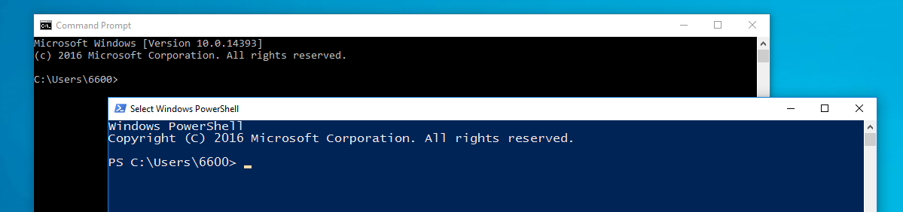

# Introduction

This Untargeted Metabolomics Pipeline tutorial is written from the first-person perspective of a Windows user with almost no programming experience, at least not at the start of developing this pipeline. An unrelated tip you may find useful is that using an external Solid State Drive (SSD) and SuperSpeed (SS) USB connections (SS USB ports are labeled with SS below them on the PC) will improve data transfer speeds. There will be lots of data transfered back and forth during processing, and  time can add up.

In programming and scripting, *syntax* is the set of rules that define the structure of a command, statement, or experession. Windows-native Command Line Interfaces (or **CLIs**), such as cmd (command prompt) and PowerShell (a more modern version of cmd), use a Windows-specific syntax. Linux (used by the Polly platform) and OSX (the Mac OS) are much more similar and there are only minor differences. That said, it is still very easy to alter a command to fit the syntax these operating systems (OS) use, assuming you know which OS you are currently using. The main problem you will run into with this, is that Windows uses the ```\``` delimiter in file paths, while pretty much everything else uses the ```/``` delimiter for file paths. For the purpose of this tutorial, "file path" refers to the directory that a file is saved to: ```C:\Users\6600\Documents```, "file name" refers to the name (plus its file extension) given to that file: ```document.txt```, and "full file name" refers to the file path + file name: ```C:\Users\6600\Documents\document.txt ```. Accessing the same file in the Linux environment, as in when using PollyCLI, this same full file name would be: ```C:/Users/6600/Documents/document.txt``` (assuming that the file is stored on the Windows device). 

On a Windows PC, the command prompt (**referred to as cmd, moving forward**) and PowerShell can be accessed quickly using **run**. To do this, open run by pressing ```WinKey + r``` (WinKey referrs to the Windows key on the bottom left of the keyboard). Then, type either "cmd" or "powershell" and hit ```Enter``` to open the cmd or PowerShell. Two quick ways to determine (or even type, really) a file path is to when you are not familiar with using a command shell (which has more efficient methods) is to drag and drop your file from the File Explorer/This PC into a cmd/PowerShell window, or click

Before beginning, it is important to state that some commands, particularly those requiring file paths, involve arguments that are user specific. This means that the demo code that works for one might not always work (or be correct) for another if it is just copy/pasted. Instead of giving code that will not work, an all-caps explanation of the user-specific argument will be placed into  ```<BRACKETS>``` that the reader will have to replace themselves. If the brackets are a part of the true code, a note will be made. Ellipsis may also be used to imply an intentional omission. Knowing this, here is what the file path *could* have looked like: ```C:\Users\<YOUR USER PROFILE>\...\document.txt```

A *drive* is a device that stores data from a computer; everything (including the operating system) that a computer needs to operate is stored within a drive. When accessing a drive, a computer must assign it a *drive letter*, which can be any letter A-Z. The letter is typically followed by a colon. A computer's primary drive, which typically contains its operating system, is assigned to C: by default. If the device has a second drive, say for data storage, this will likely be D: by default.

Data within a drive is organized into a heiarchy of directories (folders, essentially). The *root directory* of a drive, sometimes just called the root, is the highest level directory. Relative to the root, all other directories within a drive are sub-directories.


The term *relative* in the last sentence is of particular importance, and brings us to the concept of the *current directory*. The current directory refers to the directory that the current environment is operating in. 



Let's examine the image above, which shows a PowerShell window stacked on top of a cmd window. Both of these are the default windows that open, and text displayed in both windows is very similar.  Can you tell what the current directory is? We will come back to this question soon. Because PowerShell is the active window, there is a blinking cursor displayed, which indicates that PowerShell is ready to accept input. Immediately prior to this cursor is ```>```. Input goes on the right side of ```>```, and the current directory is shown to the left. The answer to my previous question then, is that ```C:\Users\6600``` is the current directory. This is the default directory, also known as the **home directory**. So then why is PowerShell displaying ```PS C:\Users\6600>```, but cmd is displaying ```C:\Users\6600>```? PowerShell is newer and more powerful than cmd; the PS is there to let the user know that they are operating in a PowerShell environment. Later in the tutorial, we will use Python within the PowerShell. Once the environment is changed to Python, ```>``` becomes ```>>>``` and the current directory is not displayed. In the Linux environment, using Terminal (the Linux equivalent to PowerShell, albiet more powerful), ```>``` becomes ```<CURRENT DIRECTORY>:-$``` (Note: ```<``` and ```>``` are used for the demo purpose, as discussed earlier). Understanding this is important when learning how to navigate directories by CLI. 


## Using cmd and PowerShell

When using the command lines, files located in directories that are higher than the current directory are not accessible **unless the full file path (including the drive letter) is given**. Similarly, files stored within sub-directories of the current directory are accessible by providing the file path **relative to the current directory**; the full path is not required. The table below lists some basic cmd and PowerShell commands, sometimes reffered to as **cmdlets**. Note that most commands/functions require an argument. The online [Microsoft Documentation](https://docs.microsoft.com/en-us/windows-server/administration/windows-commands/windows-commands#command-line-reference-a-z) has a reference page for all of the Windows commands, which explains all the syntax, arguments, and other parameters each command uses. Most questions can be answered with a quick Google search, thankfully.

| Command Name | Command | Description |
| ------------ | ------- | ----------- |
|Get-ChildItem | dir, ls, gci | Displays a list of a directory's files and subdirectories |
|Get-Content | gc, cat, type | Gets the content of the item at the specified location. |
|Set-Location aka Change Directory | cd, chdir, sl | Sets the current working location to a specified location.|
|Add-Content | ac | Adds content to the specified items, such as adding words to a file. |
|Set-Content | sc | Writes or replaces the content in an item with new content. |
|Copy-Item | copy, cp, cpi | Copies an item from one location to another. |
|Remove-Item | del, erase, rd, ri, rm, rmdir | Deletes the specified items. |
|Move-Item | mi, move, mv | Moves an item from one location to another. |
|Set-Item | si | Changes the value of an item to the value specified in the command. |
|New-Item | ni | Creates a new item. |
|Invoke-WebRequest | curl, iwr, wget | Gets content from a web page on the Internet. |
|Resolve-Path | rvpa | Resolves the wildcard characters in a path, and displays the path contents. |
|Start-Job | sajb | Starts a Windows PowerShell background job. |
|Suspend-Job | sujb | Temporarily stops workflow jobs. |
|Resume-Job | rujb | Restarts a suspended job |
|Set-Variable | set, sv | Sets the value of a variable. Creates the variable if one with the requested name does not exist. |
|Sort-Object | sort | Sorts objects by property values. |
|Where-Object | ?, where | Selects objects from a collection based on their property values. |
|Write-Output | echo, write | Sends the specified objects to the next command in the pipeline. If the command is the last command in the pipeline, … |

By far, **navigating directories by command line will be the most common command line task** this tutorial will have you execute. It is imperative that you are able to find files/paths within the command shell, but don't worry - you can **get help with any command** by simply typing ```-help``` after the command into the CLI. If this doesn't work, the ```Get-Help``` command should. Here is what these would look in PowerShell:

```-help```:

	PS C:\Users\6600> <CONFUSING_COMMAND> -help

	<COMMAND SPECIFIC HELP IS RETURNED IN THE OUTPUT>

```Get-Help```:

	PS C:\Users\6600> Get-Help -Name -<CONFUSING_COMMAND>

The output of ```Get-Help``` is more detailed. It contains:

	NAME
		<CONFUSING_COMMAND>

	SYNTAX
		<SYNTAX / ARGUMENTS FOR CONFUSING_COMMAND>

	ALIASES
		<OTHER WAYS YOU CAN INVOKE CONFUSING_COMMAND>

	REMARKS
		<OTHER MISCELANEOUS REMARKS ABOUT CONFUSING_COMMAND>	


## Practice navigating directories by command line

Let's begin with some practice. There is a text file named ```directory-test.txt```, and I would like to view it's contents using PowerShell. The directory that it is saved to is ```C:\Users\6600\Documents```. Let's open PowerShell by pressing ```WinKey + r```, typing "PowerShell", and hitting ```Enter```. PowerShell will open to the home directory. Before doing anything, let's check to make sure ```directory-test.txt``` isn't in the current directory by using the ```dir``` command. We only want to list everything that is in the current directory, so we will not need to use any arguments with the command this time. For demo purposes, the contents of the current directory are also shown using the File Explorer. 

Input:

	PS C:\Users\6600> dir

Output:


Seeing the file is not in the current directory, , let's change the directory to the ```\Documents``` folder using the ```cd``` command, and then use ```dir``` to list the contents of ```\Documents``` (Note: The ```\``` delimiter before the directory name indicates that it is a sub-directory). Entering ```cd``` will invoke the command, but to do anything useful an argument must supplied as well, so that the computer knows what directory to navigate to. As we just saw, ```Documents``` is in the current directory, so we do not need to use the full path. Remember, the current directory is displayed immediately before ```>``` (which is telling us PowerShell is ready to accept input agian.

Changing directories (output on second line):

	PS C:\Users\6600> cd Documents
	PS C:\Users\6600\Documents>

Listing the directory contents:

	PS C:\Users\6600\Documents> dir
		

	 		Directory: C:\Users\6600\Documents

	Mode                LastWriteTime         Length Name
	----                -------------         ------ ----
	d-----        2/11/2020   2:17 PM                Custom Office Templates
	d-----        1/14/2022   1:36 PM                my_env
	d-----        7/28/2020   8:46 AM                PDF files
	d-----        1/18/2022   4:34 PM                Python Scripts
	d-----        3/11/2021   2:23 PM                R
	-a----         2/9/2022   4:28 PM             51 .Renviron
	-a----        2/10/2022  10:24 AM          88952 .Rhistory
	-a----         2/9/2022   3:19 PM              0 .Rprofile
	-a----        2/18/2022   1:16 PM            135 directory-test.txt
	-a----        12/2/2020   9:25 AM         240822 Nan fig.pptx

Yay - we found our file! Using the ```gc``` (Get-Content) command, we will see what the text file says by supplying the file name as an argument:

	PS C:\Users\6600\Documents> gc directory-test.txt

Output: 

	This worked because this text file was called using the full file name (Path + Name),
	or because it was saved in the current directory.


As the file tells us, we didn't supply the file path with the file name, so this command must have worked because it was in the current directory. To test this, we are first going to use the "Copy-Item" command  the file to the ```C:\Users\6600``` (home) directory, then see if we can still view the file with the same command. Note: ```copy```, ```cp```, and ```cpi``` are all accepted syntax for the command, as shown in the table. What types of arguments do you think ```copy``` will require? If someone came up to you and said "copy", and nothing else, you might have some questions. "Copy what?" and "Copy it where?" would be perfectly reasonable things to ask. As it turns out, the computer also needs these questions answered before it is able to do what you ask, so we will supply this info in the form of arguments. 

	PS C:\Users\6600\Documents> copy directory-test.txt C:\Users\6600\directory-test.txt

There isn't a visible output so, still with ```C:\Users\6600\Documents``` as the current directory, we will check to see if the file was copied successfuly. Most of the files/folders in ```C:\Users\6600``` we do not care about, so we will use a ***wildcard character*** to filter out all files that are not \*.txt files. The Microsoft [about_Wildcards](https://docs.microsoft.com/en-us/powershell/module/microsoft.powershell.core/about/about_wildcards?view=powershell-7.2) reference page explains that "Wildcard characters represent one or many characters," meaning that they are placeholders. Here is a table describing the different wildcards:

| Wildcard | Description | Example | Match | No Match |
|----------|-------------|---------|-------|----------| 
| * | Match zero or more characters | a* |	aA, ag, Apple | banana |
| ? | Match one character in that position | ?n | an, in, on | ran |
| \[ \] | Match a range of characters | [a-l\]ook | book, cook, look | took |
| \[ \] | Match specific characters | [bc]ook | book, cook | hook |
| \`* | Match any character as a literal (not a wildcard character) | 12\`*4 | 12\*4 | 1234 |

To achieve our goal, we will replace the name of the file (without the extension) with the ```*``` wildcard, which represents any character, followed by the ```.txt``` extension. This will filter the output so that only text files will be returned:

	PS C:\Users\6600\Documents> dir C:\Users\6600\*.txt


    	
    	Directory: C:\Users\6600


		
		Mode          LastWriteTime         	Length Name
		
		----          -------------         	------ ----
		
		-a----        2/18/2022   1:16 PM   	135 directory-test.txt

Great! Only one file is returned, and we can easily tell that our file has been copied. Notice that **we did not have to change the current directory to do this. In fact, *changing the current directory is not best practice for manipulating files.* The full file path should be specified when referencing a file or path.** This is because when the file path specified is relative (aka it doesn't contain the full path, starting with the drive) to the current directory, **the command or script will not work once the current directory is changed.** Therefore, it is best to always make sure the full path is included.

Because it was not best practice to change the current directory, we should probably go back to the home directory! I hope that by now, you know that you could do this using ```cd C:\Users\6600```. This can also be accomplished by ```cd \```. To change the current directory to the current drive's root directory, ```cd ~``` can be used, but you can also simply type ```C:``` to return to the C:\ root. As each drive has a root directory, the more general form of this is ```<DRIVE_LETTER>:```.

Later on in the tutorial we will use other commands, but I hope that this introduction has given you the footing you need to continue on with this tutorial. Moving forward, I will not be typing the current directory in each code block. As we have discussed, user input comes after ```>```, so moving forward commands will look like this:

	> dir C:\Users\6600\*.txt 

or possibly this:

	> dir C:\Users\<YOUR_USER_PROFILE>\...\*.txt

In the context of this tutorial, all of these mean the same thing. Good luck moving forward! :-)
