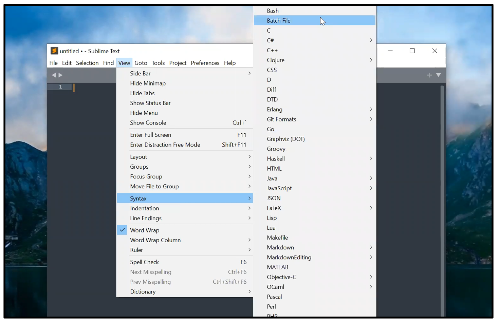
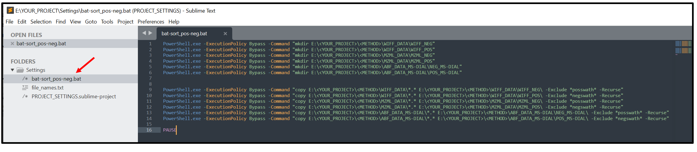

# Untargeted Metabolomics at the BAF


# Introduction

WRITE INTRO ABOUT BAF UNTARGETED METABOLOMICS HERE. INCLUDE AN OVERVIEW OF THE SITE AS WELL.

# Creating an In-House Accurate-Mass/Retention-Time Spectral Library

Spectral matching is an important part of the compound identification process, yet remains one of the greatest challenges in LC-MS based metabolomics. There are HPLC-MSMS spectral databases available for use that are great resources, such as the [NIST 20 Tandem Mass Spectral Libraries](https://chemdata.nist.gov/dokuwiki/doku.php?id=chemdata:msms), the [RIKEN MS2 libraries](http://prime.psc.riken.jp/compms/msdial/main.html#MSP), the [MoNA MS2 libraries](https://mona.fiehnlab.ucdavis.edu/downloads), and the [GNPS MS2 library](https://gnps.ucsd.edu/ProteoSAFe/libraries.jsp), but using a in-house spectral library generated from authentic chemical standards acquired under conditions identical to experimental conditions is ideal. There are multiple reasons for this. The chromatography column, mobile phase compositions, and even the composition of the solvent samples are suspended in can significantly alter the retention time of eluting analytes; altering any of these parameters can result in a useless Accurate-Mass Retention-Time (AMRT) library. For the same compound, spectra that are acquired using different mobile phase additives, polarities, acquisition types (DDA vs DIA), collision energy (CE) and collision energy spread (CES), instrument types (QTOF, Orbitrap, etc.), and instrument manufacturers (Thermo, Agilent, Sciex, etc) can vary greatly. 

Generating an in-house library, however, takes a lot of work and time. Polarity switching is not an option with high-resolution mass spectrometry, so a library must be made for positive and negative modes both. If your workflow implements orthogonal separations (such as HILIC and Reverse-Phase), this increases the number of libraries to four. It also takes planning; otherwise a lot of time can be wasted by having to start over. As you can see, it is wise to make sure everything goes right the first time. Unfortunately, there are not a lot of resources that describe, step by step, how to create a high-quality AMRT spectral library. The best protocol that I have found to date is the *Tutorial 1. Chemical standard characterization using LC-MS AIF data for AMRT MS2 library* document found in the [Supplementary Materials](https://www.ncbi.nlm.nih.gov/pmc/articles/PMC6918128/bin/metabolites-09-00251-s001.zip) section of [Creating a Reliable Mass Spectral–Retention Time Library for All Ion Fragmentation-Based Metabolomics](https://www.ncbi.nlm.nih.gov/pmc/articles/PMC6918128/). The methods presented here have been adapted from this publication. The sections below describe in detail how to create an in-house AMRT,  spectral library using SWATH acquisition on the BAF's TripleTOF 6600+ instrument. ***Note:** It is assumed that chromatography methods and an in-house compound database document/spreadsheet --complete with compound names, an in-house database key, in-house unique IDs, exact mass, adduct m/z's (exact mass), and chemical identifiers* ***( especially InChiKey and SMILES)**--* *has already been created and is ready for use. Read the* ***IN-HOUSE DATABASE SECTION** for more details.*

## Planning and Organization

Library reference spectra are acquired by injecting vials containing 5 to 10 analytical standards suspended in solvent conditions that match experimental conditions. The standards selected to be in each vial should be optimized based on obtaining the maximum separation in m/z as possible. Ideally, every compound in the vial will fall within a different isolation window. When this is not the case, compounds falling within the same isolation window *must have different retention times*, otherwise the obtained library spectra will be contaminated with one another. A balance should be found between the separation in mass of each compounds and the total number of vials that will be used; the cost of consumables adds up. Use the width of each (or average) isolation window to help find this balance. 

Determine the average isolation window width by dividing the MS1 scan range by the number of isolation windows. The current acquisition method the BAF is using at the time of has an MS1 scan with a mass range of 70 to 1100 Daltons (a range of 1,030 Da) and 36 isolation windows. The isolation windows, then, are roughly 29 Da wide. This is roughly the minimum separation in molecular weight each compound should be per vial. Hopefully this should allow for 10 per vial. At 10 compounds/vial, 400 compounds will use 40 vials for one method in both polarities.

#### Create an in-house database file

Open Excel and, in ```Sheet 1``` create a list with the names of all your compound names (Column B), their exact masses (Column C), molecular formula (Column D), InChIKey (Column E), and SMILES (Column F); make sure to add column headers. See the ***CHEMICAL IDENTIFIERS SECTION*** for more about InChIKey and SMILES. **Verify that the chemical identifiers are not for the ionized or salt form of the compound, as these have different identifiers and using an incorrect identifier will lead to inaccurate spectral annotations**. Save the Excel file to ```E:\<YOUR_PROJECT>\Compound_DB\your_DB.xlsx```. This directory will be where all records about your compounds will be saved to.

Navigate to the Data tab and use ```Sort``` to sort the compounds by their exact mass. Create another spreadsheet, ```Sheet 2```, and create a numerical list in Column A going from 1 (cell ```A1```) to 40 (cell ```A40```). Copy cells ```A1:A40```, and past in cell ```A41``` to stack a second list directly below the first. Copy cells ```A1:A80```, and paste into cell ```A81```. Continue doing this until each number, 1 through 40, is repeated a total of 10 times. The list should extend the range ```A1:A400``` and follow the pattern: ```1, 2,... 40, 1,... 40, 1,... 40```. Copy ```A1:A400```, navigate to ```Sheet 1```, and paste into cell ```A2```. Add the column heading "Vial_Number" to cell ```A1```. At this point, the spreadsheet should resemble the table below, but this will change as more fields are added. Make sure that column headers don't have any spaces or special characters (other than ```-``` and ```_```); this ensures that their titles can be interpreted correctly by any programs that may be used in the future.

| Vial_Number | Compound_Name | Exact_Mass | Formula | InChIKey  | SMILES   |
| ----------- | ------------- | ---------- | ------- | --------- | -------- |
| 1 		  | Compound 1    | 101 Da	   | FORMULA | InChIKey  | SMILES   |
| 2 		  | Compound 2    | 101 Da	   | FORMULA | InChIKey  | SMILES   |
| 3 		  | Compound 3    | 103 Da	   | FORMULA | InChIKey  | SMILES   |
| ...		  | ...	          | ...   	   | ...     | ...       | ...      |
| 38 		  | Compound 398  | 800 Da	   | FORMULA | InChIKey  | SMILES   |
| 39 		  | Compound 399  | 850 Da	   | FORMULA | InChIKey  | SMILES   |
| 40 		  | Compound 400  | 900 Da	   | FORMULA | InChIKey  | SMILES   |

Now, ```Sort``` all 3 columns by ```Vial_Number``` then by ```Exact_Mass```. This should provide the best separation possible using 10 compounds/vial. Check that each vial does not contain any isobaric compounds, especially those which are also isomeric or structurally similar. Estimate the separation in mass of the compounds in each vial. If necessary, repeat this process using 80 vials instead of 40 vials so that there are 5 compounds/vial, but there's a good chance that the majority of the vials will be fine once retention time is factored in. If, after running the vials, there are only a couple of problem compounds, these can just be re-ran. Prior knowledge of retention time info (from method development, maybe) can minimize the amount that need to be re-ran. The order of the compounds in this spreadsheet will be the order that the standard stock solutions are sorted within boxes for storage; eventually the column, the row, and the box number describing where each compound is stored will be added to the spreadsheet. This makes them easy to find when analyzing data and when physically trying to physically find the stock.

Once the compounds to placed in each vial has been finalized, insert a column titled ```DB_Key``` (Database Key) before the ```Vial_Number``` column (which should now be Column B). Underneath the new column heading in cell ```A2```, begin numbering each row sequentially. The ```DB_Key``` column is very useful: by using it as a parameter to sort by, we can always return to the order that describes each compound's storage position and injection sequence. We can also use it as key for joining two different tables. To ensure sorting always goes correctly, make sure to have every number in the ```DB_Key``` column have 4 digits (unless you think your library will ever have 10,000+ compounds, in which case do 5 digits). You can make sure Excel stores the numbers as text by including the ```'``` escape-character before the numbers (such as ```'0001```). Otherwise, Excel won't keep the zeros in front of 1, 2, and 3 digit numbers.

Insert four columns after ```Exact_Mass``` titled ```Bx_Type```, ```Bx_Number```, ```Bx_Column```. and ```Bx_Row```, then continue on to the next subsection. The In-House Database spreadsheet should now look like the table below. Notice the example of a compound in a 15 mL Falcon tube in row 3. By adding the ```Bx_Type``` column, the database can be sorted by the type of box first, then by ```DB_Key```, so that you can pull a box out of storage and go down the list sequentially to find compounds.

| DB_Key | Vial_Number | Compound_Name | Bx_Type | Bx_Number | Bx_Column| Bx_Row | Exact_Mass 	  | Formula | InChIKey  | SMILES   |
| ------ | ----------- | ------------- | ------- | --------- | -------- | ------ | -------------- | ------- | --------- | -------- |
| 0001   | 1		   | Compound 1    | REG  	 | BXOO1 	 | A   	    | 1  	 | 101 Da		  | FORMULA | InChIKey  | SMILES   |
| 0002   | 1 		   | Compound 11   | REG  	 | BXO01 	 | B   	    | 1  	 | 131 Da		  | FORMULA | InChIKey  | SMILES   |
| 0003   | 1 		   | Compound 21   | TALL 	 | BXTO1 	 | A   	    | 1  	 | 141 Da		  | FORMULA | InChIKey  | SMILES   |
| ...    | ...	       | ...	       | ...  	 | ...   	 | ... 	    | ...	 | ...   		  | ...     | ...	    | ...      |
| 0398   | 40 	       | Compound 380  | REG  	 | BX011 	 | G   	    | 4  	 | 450 Da		  | FORMULA | InChIKey  | SMILES   |
| 0399   | 40 	       | Compound 390  | REG  	 | BX011 	 | H   	    | 4  	 | 650 Da		  | FORMULA | InChIKey  | SMILES   |
| 0400   | 40 	       | Compound 400  | REG  	 | BX011 	 | I   	    | 4  	 | 900 Da		  | FORMULA | InChIKey  | SMILES   |

#### Storing Standards

Prepare 81-slot cardboard boxes as permanent storage containers. Using a label maker assign each box a name/number; make sure that the number has 3 digits so that the computer can sort them correctly. For example: BX001,... ,BX009, BX010. Using a label maker, assign each "column" in the box a letter, and assign each row a number. We prefer to skip a row in each box to making grabbing the standards easier. Some analytes are stored in a 15 mL Falcon tube, so these require a taller box. Name these boxes, if you need, BXT01, BXT02, etc. The number of digits/characters in every box name should be the same. See the image below for more details. If it has not been done already, prepare 10 mM standard stock solutions in a 1.5 mL Eppendorph or LCMS vial by dissolving a couple mg of each standard in an appropriate solvent. Once every standard has been prepared, arrange them in the boxes like the image below shows.


Determine the working concentration you will use to run your standards. The spectra for each compound must come from a peak that has a strong signal, but **cannot be saturated**. Multiple injections of different volumes will mimic a dilution series, so it does not have to be prepared in the perfect concentration. For the BAF, we are currently preparing 100 μM standards in 200 μL final volume by diluting 10 mM stocks by 100X, so there is 20 μL (2 μL × 10 standards) of stock standard in each vial. 100 μM was decided upon based on experimental observation of peak intensity. The quantities of each standard injected should reflect instrument sensitivity; the XIC peak height of the sample taken should be between 10<sup>4</sup> AU and 10<sup>7</sup> AU. To prepare 5 master mix aliquots of for 100 μM standards in 200 μL final volume, add 2 μL of each 10 μM standard to a 1.5 mL Eppendorph so that there is 20 μL total of 1 mM standards. These will be diluted by 10X in 180 μL of resuspension solvent to give a 100 μM working solution. There are only \~40 "vials", so storing these in an easy-to-find manner is more straightforward.

## Acquiring Data for an AMRT Library

The characterization and documentation of analyte retention-time is one of the primary goals of developing an in-house AMRT spectral library. Accurate mass, retention-time, and spectral similarity are the three primary **"orthogonal properties"** that can be used to identify a compound with an MSI Level I confidence level. However, spectral matching alone is insufficient, and retention-time can drift over time and is not reproducible between laboratories, creating challenges for confidient identifications. *Tada et al.* explains this in some detail:

>"RT characterization initially appears to be straightforward, simply requiring notation of the elution time of the injected chemical standard on the LC–MS system. However, RT can fluctuate depending on many factors, including the LC–MS system setup, solvents, column batches, etc. For example, some HILIC columns are prone to fluctuations in RT even within the same system and sorbent batch, which can complicate method transfer across laboratories and decrease long-term consistency. The challenge of RT shifts can be illustrated using two isobaric compounds, valine and betaine. In Naz et al., who employed the same zic-HILIC method and instrumentation as this study, valine and betaine eluted at 6.79 and 7.10 min, respectively, while in the current work, they eluted at 7.21 and 7.41 min, respectively. It is difficult to confidently identify these two compounds based solely on AMRT. The addition of MS2 spectra does not easily resolve this RT complication because low-molecular-mass metabolites with different structures may exhibit similar MS2 spectra... RT characterization is necessary for reliable identification"
>
>**--*Creating a Reliable Mass Spectral–Retention Time Library for All Ion Fragmentation-Based Metabolomics.* Tada et al, 2019**

#### Utilize internal standards to characterize retention-time

This issue is addressed by performing multiple injections over a period of 2-3 days (min), coupled with the use of technical retention-time standards with RTs that are well-distributed throughout the throughout the LC run. This allows both the instrument performance (peak shapes and peak intensities) and RT drift to be assessed and, when applicable, corrected for. For a metabolite to be identified by RT and accurate mass, the accepted RT tolerance usually a 0.5 minute window. However, even under identical conditions, the average RT will drift over time, adversely affecting retention-time precision. Without running every standard with each experiment, which is not practical for time and financial reasons, it is difficult to reliably use retention-time as a parameter for identification even when all experiments are performed in the same laboratory. Tracking the average RTs of each analyte and the CV of RTs provides measurable parameters that can be used to assess whether or not an AMRT spectral library is suitable for MSI Level I compound annotations. Test candidate internal standards by preparing each standard in the same vial at an appropriate concentration. Inject the standard mixture onto both columns and acquire in both polarities. The best compounds will be ones that ionize in both positive and negative mode, are retained on both columns, and are not present in biological samples. The same ones do not have to be used for both separations, but it is convenient if they can be. For each separation, choose about 5 standards that are distributed throughout the column's elution profile. 

#### Preparing Vials for Injection

It is known that the solvent composition of the injected sample can adversely affect analyte retention, especially for the compounds that elute in the isocratic or early gradient phases of the run. Once the RT standards have been decided upon, **dissolve the RT standards in the solvent mix that will be used to dilute the 20 μL aliquots (1 mM) of each vial's master mix**. Be careful preparing the solvent master mix-- make sure to account for all of the components in the vial so that the solvent composition and standard concentrations are correct; **make sure to factor in the solvent composition of the stock solution!** Here at the BAF, our reverse-phase separation calls for a final solvent composition of 10% aqueous methanol, and our HILIC separation calls for 80% aqueous acetonitrile. Add 180 μL of each solvent master mix containing RT internal standards to a 20 μL aliquot of vial master mix. There will be 2 of each "vial" total, so 400 compounds at 10 compounds/vial will require 80 vials. This takes time to run, so do not prepare both at once or some analytes will likely experience degradation in solution.  

#### Submitting the samples for acquisition

To assess RT drift and analyte response curves, each vial is to be injected 4 times with different volumes for each polarity and method; this means 16 injections total for each. Though a true standard curve would be ideal, it is not cost-efficient to prepare a dilution series for every vial: it would take 560 vials, caps, and inserts to run 400 compounds using two methods. This would cost at least $1,000 in vials and inserts alone. Using a 20 minute analytical method, it will take >13 hours to inject 40 vials one time. Create an acquisition batch and add all the samples for both methods and polarities. Be sure to include the following information in the name of each data file:

- Vial #
- Injection volume
- HILIC or RP

**It is very important to include this information in the name of the sample** because we will use the file names later to sort the data into new directories using ```PowerShell``` after all the data has been acquired. Prepare the acquisition batch so that the vials are injected in the order described in the table below. Perform auto-calibration every 10 injections. 

| Injection # | Vial Number | Method | Polarity | Injection Vol (mL) |
| ----------- | ----------- | ------ | -------- | ------------------ |
| 1 		  | 1  			| HILIC  | POS 		| 0.25 				 |
| ...  		  | ...			| ...    | ...    	| ...  				 |
| 40 		  | 40 			| HILIC  | POS 		| 0.25 				 |
| 41 		  | 1  			| HILIC  | POS 		| 1.00 				 |
| ...  		  | ...			| ...    | ...    	| ...  				 |
| 80 		  | 40 			| HILIC  | POS 		| 1.00 				 |
| 81 		  | 1  			| HILIC  | POS 		| 2.00 				 |
| ...  		  | ...			| ...    | ...    	| ...  				 |
| 120 		  | 40 			| HILIC  | POS 		| 2.00 				 |
| 121 		  | 1  			| HILIC  | POS 		| 4.00 				 |
| ...  		  | ...			| ...    | ...    	| ...  				 |
| 160 		  | 40 			| HILIC  | POS 		| 4.00 				 |
| BLANK		  | BLANK		| BLANK	 | BLANK	| BLANK				 |
| 161 		  | 1  			| HILIC  | NEG 		| 0.25 				 |
| ...  		  | ...			| ...    | ...    	| ...  				 |
| 200 		  | 40 			| HILIC  | NEG 		| 0.25 				 |
| 201 		  | 1  			| HILIC  | NEG 		| 1.00 				 |
| ...  		  | ...			| ...    | ...    	| ...  				 |
| 241 		  | 40 			| HILIC  | NEG 		| 1.00 				 |
| 242 		  | 1  			| HILIC  | NEG 		| 2.00 				 |
| ...  		  | ...			| ...    | ...    	| ...  				 |
| 280 		  | 40 			| HILIC  | NEG 		| 2.00 				 |
| 281 		  | 1  			| HILIC  | NEG 		| 4.00 				 |
| ...  		  | ...			| ...    | ...    	| ...  				 |
| 320 		  | 40 			| HILIC  | NEG 		| 4.00 				 |
| BLANK		  | BLANK		| BLANK	 | BLANK	| BLANK				 |
| 321 		  | 1  			| RP     | POS 		| 0.25 				 |
| ...  		  | ...			| ...    | ...    	| ...  				 |
| 360 		  | 40 			| RP     | POS 		| 0.25 				 |
| 361 		  | 1  			| RP     | POS 		| 1.00 				 |
| ...  		  | ...			| ...    | ...    	| ...  				 |
| 400 		  | 40 			| RP     | POS 		| 1.00 				 |
| 401 		  | 1  			| RP     | POS 		| 2.00 				 |
| ...  		  | ...			| ...    | ...    	| ...  				 |
| 440 		  | 40 			| RP     | POS 		| 2.00 				 |
| 441 		  | 1  			| RP     | POS 		| 4.00 				 |
| ...  		  | ...			| ...    | ...    	| ...  				 |
| 480 		  | 40 			| RP     | POS 		| 4.00 				 |
| BLANK		  | BLANK		| BLANK	 | BLANK	| BLANK				 |
| 481 		  | 1  			| RP     | NEG 		| 0.25 				 |
| ...  		  | ...			| ...    | ...    	| ...  				 |
| 520 		  | 40 			| RP     | NEG 		| 0.25 				 |
| 521 		  | 1  			| RP     | NEG 		| 1.00 				 |
| ...  		  | ...			| ...    | ...    	| ...  				 |
| 560 		  | 40 			| RP     | NEG 		| 1.00 				 |
| 561 		  | 1  			| RP     | NEG 		| 2.00 				 |
| ...  		  | ...			| ...    | ...    	| ...  				 |
| 600 		  | 40 			| RP     | NEG 		| 2.00 				 |
| 601 		  | 1  			| RP     | NEG 		| 4.00 				 |
| ...  		  | ...			| ...    | ...    	| ...  				 |
| 640 		  | 40 			| RP     | NEG 		| 4.00 				 |


Once you have acquired both polarities for one method, change the column, change the solvents/purge the binary pump system, prepare the next batch of standards, then continue with the sequence described in the table. 

## Data Pre-Processing

After both methods are done running, transfer the HILIC files to ```E:\<YOUR_PROJECT>\HILIC``` and transfer the Reverse-phase files to ```E:\<YOUR_PROJECT>\Reverse-phase``` on your external drive. Next, convert the ```*.wiff``` files to ```*.mzmL``` format using *msconvert* and save them to ```E:\<YOUR_PROJECT>\<METHOD>\MZML_DATA```. Then, convert the ```*.mzML``` files to ```*.abf``` format using the *Abf File Converter* program and save them to ```E:\<YOUR_PROJECT>\ABF_DATA_MS-DIAL```. Make sure to centroid MS1 **and** MS2 spectra when converting to ```*.mzML``` format. See the ***FILE CONVERSION*** section for more details. At this point, the structure of ```E:\<YOUR_PROJECT>``` should look similar to the image below:


#### Create a BAT file to separate and sort positive and negative data files

Before moving forward, we are going to have to do a lot of sorting and copying with the our files. The *MsdialConsoleApp* (found at ```D:\MSDIAL ver.4.80 Windows\MsdialConsoleApp.exe```, on the TripleTOF Data PC) will be used to automate the process of finding the peak corresponding to the standard of interest. The automation is very useful and allows our analysis to be scaled to large datasets without becoming tedious. Because there are only ten genuine compounds per vial, the majority of the features detected by MS-DIAL are not of interest and sorting through them is time consuming. The workflow operates on one target mass at a time, on a "per folder" basis. This means that a sub-directory within the ```\ABF_DATA_MS-DIAL``` directory needs to be created for every compound, and each ```*.abf``` file will be copied 10 times into . Not only do we have to create 400 folders for each method and polarity (1600 folders), but because there are 10 compounds in each vial, we will also need to make 10 copies of each ```*.abf``` file! This sounds tedious, but we will automate the command line using ```*.bat``` (batch) files to take the grunt work out of it. A ```*.bat``` file is a file that is used to execute commands using ```cmd```. As you can [read about here](https://fileinfo.com/extension/bat), it is contains lines of plain text that are input into the Windows Command Prompt to execute commands. BAT (batch) files don't actually interact with ```PowerShell```, but ```PowerShell``` can be used within Command Prompt, so we can work around this and continue using ```PowerShell``` through ```cmd```. You can read more about working with ```PowerShell``` using ```*.bat``` files, including some common issues, [here](https://www.howtogeek.com/204088/how-to-use-a-batch-file-to-make-powershell-scripts-easier-to-run/). The goal of our first ```*.bat``` file is to sort all the different file types we have into positive and negative sub-directories within their current folders, as shown in the image below. This will be a good warm up for when we make a more complex BAT file later. 


For this demonstration, we will only be working with a generic ```<METHOD>``` (HILIC or Reverse-phase). At the end, the contents of each file will be given. To substitute in your directory, just highlight ```<YOUR_PROJECT>``` and ```<METHOD>``` (one at a time) and press ```ctrl+d``` to highlight the other instances of the highlighted text. Once highlighted, use the multiple cursors to type your file path. If you are working with files from both methods, either make two BAT files or duplicate everything shown in the demonstration and replace the directories as appropriate. 

 

To get started, open up Sublime. You should be starting with a blank page. To take advantage of Sublime's syntax highlighting, click the ```View``` tab and hold your mouse over the Syntax drop down menu. Click on "Batch", as shown in the image above. Once you've done this, press ```Enter``` until there are 12 lines in the document. ```ctrl+left click``` each line, or click and drag with the mouse wheel over each line. You should now have a cursor in all 12 lines. Type ```PowerShell.exe -ExecutionPolicy Bypass -Command```. This should populate all 12 lines with your input. If you have correctly set Sublime to Batch syntax, the program being called by ```cmd``` will be in blue text (PowerShell.exe), commands will be in orange text, and the argument to a command will be in green text. Your document should look like the image below. Also notice the "MiniMap" that the red arrow is pointing to; this can be used to navigate the document quickly and will be useful later when our BAT file gets quite long. 


You probably noticed the ```-ExecutionPolicy Bypass``` command that we used. The "Execution Policy" describes a Windows security feature that limits (or doesn't limit, depending on it's setting) permissions related to running scripts, which can sometimes be restrictive. These can be changed relatively easily, but this could turn into a security problem if it not changed back. Instead, when we call ```PowerShell``` from ```cmd```, we can include this paramter to the ```PowerShell.exe``` command to spawn a PowerShell instance that bypasses the Execution Policy; the configuration will not persist beyone the session.

For some reason, I was unable to get the BAT file to create the new positive and negative sub-directories while executing the copy command, so we will have two sets of commands: one that makes the new sub-directories, and one that sorts and copies each of the files into the appropriate sub-directory. Inputing ```Enter``` to ```PowerShell``` or ```cmd``` won't hurt anything, so click at the start of line 7 and press ```Enter``` twice to add some lines between the two sets of commands. This is just to improve readability.

Insert a cursor after "-Command" on the first 6 rows and type ``` "mkdir ``` (make sure to include the spaces before and after). Insert a cursor after "-Command" on rows 9-14 and type ``` "copy ``` (remember spaces). Place a cursor at the end of each line on lines 1-6 and lines 9-14; type ```E:\<YOUR_PROJECT>\<METHOD>\WIFF_DATA\```. This should populate most of the file for you. Fill in the remaining based on the picture below. Include ```PAUSE``` at the end as shown; this will prevent ```cmd``` from closing until you provide an input (such as hitting the space bar), which lets you know that the batch is done being processed. Save the file as ```E:\<YOUR_PROJECT\Settings\batch-sort_pos-neg.bat```; if you have added the settings folder to the Sublime project, you should see the file in the sidebar now (red arrow).



If you can't see, here is the text:

	PowerShell.exe -ExecutionPolicy Bypass -Command "mkdir E:\<YOUR_PROJECT>\<METHOD>\WIFF_DATA\WIFF_NEG"
	PowerShell.exe -ExecutionPolicy Bypass -Command "mkdir E:\<YOUR_PROJECT>\<METHOD>\WIFF_DATA\WIFF_POS"
	PowerShell.exe -ExecutionPolicy Bypass -Command "mkdir E:\<YOUR_PROJECT>\<METHOD>\MZML_DATA\MZML_NEG"
	PowerShell.exe -ExecutionPolicy Bypass -Command "mkdir E:\<YOUR_PROJECT>\<METHOD>\MZML_DATA\MZML_POS"
	PowerShell.exe -ExecutionPolicy Bypass -Command "mkdir E:\<YOUR_PROJECT>\<METHOD>\ABF_DATA_MS-DIAL\NEG_MS-DIAL"
	PowerShell.exe -ExecutionPolicy Bypass -Command "mkdir E:\<YOUR_PROJECT>\<METHOD>\ABF_DATA_MS-DIAL\POS_MS-DIAL"
		
		
	PowerShell.exe -ExecutionPolicy Bypass -Command "copy E:\<YOUR_PROJECT>\<METHOD>\WIFF_DATA\*.* E:\<YOUR_PROJECT>\<METHOD>\WIFF_DATA\WIFF_NEG\ -Exclude *posswath* -Recurse"
	PowerShell.exe -ExecutionPolicy Bypass -Command "copy E:\<YOUR_PROJECT>\<METHOD>\WIFF_DATA\*.* E:\<YOUR_PROJECT>\<METHOD>\WIFF_DATA\WIFF_POS\ -Exclude *negswath* -Recurse"
	PowerShell.exe -ExecutionPolicy Bypass -Command "copy E:\<YOUR_PROJECT>\<METHOD>\MZML_DATA\*.* E:\<YOUR_PROJECT>\<METHOD>\MZML_DATA\MZML_NEG\ -Exclude *posswath* -Recurse"
	PowerShell.exe -ExecutionPolicy Bypass -Command "copy E:\<YOUR_PROJECT>\<METHOD>\MZML_DATA\*.* E:\<YOUR_PROJECT>\<METHOD>\MZML_DATA\MZML_POS\ -Exclude *negswath* -Recurse"
	PowerShell.exe -ExecutionPolicy Bypass -Command "copy E:\<YOUR_PROJECT>\<METHOD>\ABF_DATA_MS-DIAL\*.* E:\<YOUR_PROJECT>\<METHOD>\ABF_DATA_MS-DIAL\NEG_MS-DIAL\ -Exclude *posswath* -Recurse"
	PowerShell.exe -ExecutionPolicy Bypass -Command "copy E:\<YOUR_PROJECT>\<METHOD>\ABF_DATA_MS-DIAL\*.* E:\<YOUR_PROJECT>\<METHOD>\ABF_DATA_MS-DIAL\POS_MS-DIAL\ -Exclude *negswath* -Recurse"
	
	PAUSE	

Commands are passed to PowerShell from the BAT file using the ```-Command``` parameter, with the command's argument in quotes. The first set of commands, using ```mkdir```, creates the new directories for the positive and negative folders. For the second set of commands, each individual command copies all files in the specified directory that have a ```.``` in their name, and other characters on either side of the ```.``` (notice the use of the ```*``` wildcard. When making this command initially, I only used ```...DATA\*``` instead of ```...DATA\*.*```. Using the wildcard this way copies *everything* (including the sub-directories made using the first set of commands). This did not work, because it created a continuous loop of copying and pasting the contents of each sub-directory back into itself until eventually an error was returned because the file path became too long. I mention this to stress the importance of correctly matching strings of text using wildcards. The sorting is accomplished by using the ```-Exclude``` parameter on the ```copy``` command, and we once again use ```*``` wildcards to exclude files containing "posswath" or "negswath" in their name from the command. Once you have saved the text as a ```*.bat``` file, open File Explorer to the ```E:\<YOUR_PROJECT>\Settings``` directory. Simply double click ```batch-sort_pos-neg.bat``` to execute the BAT commands. The two images below shows each directory before and after executing the BAT commands.


Open each of the new sub-directories and make sure that positive and negative files were copied into the appropriate sub-directories successfully, and then delete the old copies of the files that are still in the ```E:\<YOUR_PROJECT>\<METHOD>\WIFF_DATA``` (and also ```\MZML_DATA``` and ```\ABF_DATA_MS-DIAL```) directories; we don't need two copies of each file. Hopefully everything went well making your first ```*.bat``` file!

  

#### Create another BAT file to copy ```*.abf``` into compound-specific folders

Now, within ```E:\<YOUR_PROJECT>\<METHOD>\ABF_DATA_MS-DIAL\POS_MS-DIAL``` and ```E:\<YOUR_PROJECT>\<METHOD>\ABF_DATA_MS-DIAL\NEG_MS-DIAL``` both, we must create a directory matching the pattern ```\DB-KEY_COMPOUND-NAME_InChiKey``` for every compound in the library. Including the number for the in-house database key (not unique ID) makes it to keep the files in the same order as the in-house database file, and including the compound name and InChiKey makes it easier to validate putatitve spectral annotations from when we perform spectral matching while processing the library files. At the time of making this tutorial, the library has 397 compounds, so the ```*.bat``` we make to do this will be quite long. We will use the ```CONCATENATE()``` and auto-fill functions in Excel to make this process a bit easier. The result of our 2nd BAT file will be to create compound sub-directories as shown in the image below; the data files will be copied into the directories we create here after we make our 3rd BAT file.

   

Get started by opening up the in-house database Excel file you made earlier in this section. Make sure that it is sorted in descending order by ```DB_Key```. Copy and paste all the compound names into an empty Sublime document. One issue you may have is that the compound names in your DB may include characters that are not appropriate for a file name, such as spaces, ```,```, ```'```, ```(```, or ```)```. These will all need to be removed before concatenating the compound names into our commands. This took me about 5 minutes in Sublime by highlight one of the characters to be deleted and then using ```ctrl+d``` to highlight the other instances, but "Find and Replace" in Word or Excel is pretty easy too. Once you are done, paste the names into Column B of a blank Excel spreadsheet. Also paste the ```DB_Key``` and ```InChiKey``` of each compound into Column A and Column C, respectively. Your spreadsheet should look similar to the photo below.

 

Next, enter the following text into cell D1: ```=CONCATENATE(A1,"_",B1,"_",C1,"""")```; apply the formula to every row. All of the ```"``` in the last bit of the formula are included just to add one ```"``` to the end of the text. We have to include so many because the ```"``` is how Excel recognizes input text. The result should be like what is shown below:

 


Copy each row with text in Column D of the Excel spreadsheet and paste it into a blank Sublime document; these lines will be referred to as "Set 1". Insert two to four lines below the last compound, and paste all the compound names again; these lines will be referred to as "Set 2". Set the syntax of the Sublime document to "Batch", then insert a cursor at the start of every line within Set 1. This will be easiest to do by clicking and dragging with the mouse wheel, then pressing ```←``` once to navigate to the beginning of the highlighted text. You can use the "MiniMap" on the right hand side of the Sublime window to find the gap between Set 1 and Set 2; the empty lines you added should be easy to spot. Once your cursors are at the start of every line in Set 1, type ```PowerShell.exe -ExecutionPolicy Bypass -Command "mkdir E:\<YOUR_PROJECT>\<METHOD>\ABF_DATA_MS-DIAL\NEG_MS-DIAL\```. This should have populated the commands for the ```\NEG_MS-DIAL``` sub-directories. Insert a cursor at the start of every line in Set 2, and type ```PowerShell.exe -ExecutionPolicy Bypass -Command "mkdir E:\<YOUR_PROJECT>\<METHOD>\ABF_DATA_MS-DIAL\POS_MS-DIAL\```. Substitute ```<YOUR_PROJECT>``` and ```<METHOD>``` as appropriate. After the last command, enter two blank lines; on the very last line type ```PAUSE```, so that ```cmd``` will prompt us before closing. Finally, insert two blank lines before the first command; on the very first line, type ```@ECHO off```. ```@ECHO off``` silences the commands being input to ```cmd```; there will be a lot of input and seeing each line will make the Command Prompt unreadable while it is executing commands. The result should look similar to the image below (```@ECHO off``` and ```PAUSE``` aren't shown; make sure they're included). It is extremely long, so the text from this BAT file will be provided at the very end of this section.


Assuming everything has gone according to plan, save the file as ```E:\<YOUR_PROJECT>\Settings\pos-neg_compound-directories.bat```. In File Explore, double click the ```*.bat``` file you just made to execute the contents of the file. The Command Prompt should open, and you will see the output of each command as it is passed to ```cmd``` and executed, as shown in the image below.


Once it is done running, navigate to ```\NEG_MS-DIAL``` and ```\POS_MS-DIAL``` and make sure they look similar to the image below.


#### Create a 3rd BAT file to copy the data files into the new directories

Now that directories for each compound have been made, it is time to copy the data files for each vial into the appropriate directory. This will again be done using wildcards; this time to match a string of text that differentiates the file names based on the vial number, but does not differentiate based on injection volume. This depends on the name of data file given to each sample while creating the acquisition batch; in my case, all of the file names contain the string ```vial-X``` (where X is the vial number) somewhere in the middle of the file name, so ```E:\<YOUR_PROJECT>\<METHOD>\ABF_DATA_MS-DIAL\NEG_MS-DIAL\*vial-X*``` and ```E:\<YOUR_PROJECT>\<METHOD>\ABF_DATA_MS-DIAL\POS_MS-DIAL\*vial-X*``` can be used to match the right vials. 

Open a blank Sublime document and a blank Excel spreadsheet to get started. In cell A1 of the blank Excel spreadsheet, type ```PowerShell.exe -ExecutionPolicy Bypass -Command "copy E:\YOUR_PROJECT\ABF_DATA_MS-DIAL\NEG_MS-DIAL\*vial-```. Copy this, and paste into cells A2 through A397 (there are 397 compounds in the library at the time of making the tutorial; adjust appropriately). In your in-house database file, you should have in each row the vial number each compound is in; copy this from the DB file, then paste it into Row B of the spreadsheet we are using to build the BAT file. In Row C, add a ```*``` to each row next to the vial number. Hopefully, when concatenate these 3 columns together, the result will be ```PowerShell.exe -ExecutionPolicy Bypass -Command "copy E:\YOUR_PROJECT\ABF_DATA_MS-DIAL\NEG_MS-DIAL\*vial-X*```. If you need to match a different string of text because your files are named differently, make the appropriate adjustments. Concatenate cells A1, B1, and C1 by entering ```=CONCATENATE(A1, B1, C1)``` into Cell D1. Copy the formula, and apply it cells D2 through D397. Make sure that your spreadsheet looks like the image below before continuing.


Either open ```E:\<YOUR_PROJECT>\Settings\pos-neg_compound-directories.bat``` in Sublime (remember that double-clicking the file in File Explorer will execute the BAT file, not open it) and **copy its contents** into a blank Sublime document, or you can copy the example text for our last BAT file that is included at the end of this section and paste it into a blank Sublime document. Once you have the contents of the previous BAT file open in Sublime, highlight ```mkdir``` and hold ```ctrl+d``` to highlight every instance of the text string (which should be in every line). Now that you have a cursor in every line, delete all the text in each line to the left of the file paths. Make sure you don't accidentally backspace too far and delete the "new line" characters; we need the paths to stay on their same lines. Copy all of the file paths in Set 1 of ```E:\<YOUR_PROJECT>\Settings\pos-neg_compound-directories.bat``` (as in, only the paths for the negative files). Paste these file paths into Column E in your Excel spreadsheet. If Excel is giving you trouble and pasting into multiple columns, try using ```Paste Special - Delimited``` and removing all the delimiters. Once pasted into Excel, you can close the Sublime document. In cell F1 of your spreadsheet, type ```=CONCATENATE(D1, " ", E1)```; make sure there is a space between the two sets of text. This should produce something similar to ```PowerShell.exe -ExecutionPolicy Bypass -Command "copy E:\YOUR_PROJECT\ABF_DATA_MS-DIAL\NEG_MS-DIAL\*vial-1* E:\<YOUR_PROJECT>\<METHOD>\ABF_DATA_MS-DIAL\NEG_MS-DIAL\0001_4-Hydroxybenzoic_acid_FJKROLUGYXJWQN-UHFFFAOYNA-N"``` in cell F1. If it did, copy the formula to cells F2 through F397. Paste Column F into a blank Sublime document, and change the syntax to "Batch". Hopefully, your Sublime batch document looks like what's shown in the image below.


After copying files into compound-specific directories:


## Library Spectra Processing with MS-DIAL, MS-FINDER, and MS-LIMA

Once the MS-DIAL projects for each compound have been processed and created, the next step in generating an in-house spectral library is to manually inspect the spectra generated from the authentic analytical standards that were ran. Then, the spectra that are deemed satisfactory are sent to MS-FINDER for further processing. When possible, at least two mass spectra for each compound are to be collected. Ideally, one of these spectra will be generated using the CorrDec algorithm, and the other will be created with the MS2Dec algorithm. The CorrDec spectra are typically MUCH better than the MS2Dec spectra, so CorrDec spectra have a higher priority than MS2Dec. A protocol on how to process these spectra is provided below the subsequent discussion paragraphs.

The exception to the "collect 2+ spectra" rule mentioned earlier is when looking at compounds that are not optimal for the current "mode," in which case only one spectrum corresponding to the most abundant adduct needs to be taken. These modes are HILIC(+), HILIC(-), RP(+), and RP(-). Non-optimal compounds for a specific mode would be those that are unlikely to be detected in a biological sample using the current column and polarity. These would be compounds that are not biological, or that display poor sensitivity, retention, etc. Examples where collecting multiple spectra, especially those of different adducts,  would be some small and polar amino acids on the RP column, or  on the HILIC column. In these cases, try to get one CorrDec spectrum if possible and then move on. If you cannot get a good CorrDec spectrum but there is a good signal, find an MS2Dec spectrum that is not saturated. Sometimes certain factors, such as peak-shape disruption due to injection volume or poor integration, can adversely affect the CorrDec algorithm due to reduced correlation of MS2 signals between samples. Again, use MS2Dec in these instances. 

This will make more sense after reading the subsequent sections, but... **The most important thing to do during this process is to add the *correct* InChiKey to each spectral entry in *MS-FINDER* so that spectra can be grouped properly when imported into MS-LIMA. For each compound (including adducts), all spectra should have the same InChiKey, SMILES, and Formula. Use PubChem as a reference for "correct". Make sure the identifiers are describing the correct compound! The compound should not be in its ionized form. Sometimes the matched InChiKey is to a non-biological isomer. If this is the case, search the compound by its common name. The PubChem entry for the common name of the neutral compound is typically correct. Be aware that the conjugate acids/bases, as well as straight-chain/cyclized sugars, etc. are technically different molecules with unique identifiers.**

The general steps to collect, annotate, and curate spectra from authentic chemical standards for an in-house spectral library using the MS-DIAL GUI program are given below. It is assumed that [MS-DIAL ver 4.48](http://prime.psc.riken.jp/compms/msdial/download/repository/), [MS-FINDER](http://prime.psc.riken.jp/compms/msfinder/download/repository/MSFINDER%20ver%203.52.zip), and [MS-LIMA](https://github.com/tipputa/MS-LIMA-Standard//releases/latest) have been installed (*TIP: Install these programs on your Data D:\ drive, then add each program's folder [to the PATH System Environment Variable](https://docs.microsoft.com/en-us/previous-versions/office/developer/sharepoint-2010/ee537574(v=office.14)) so that they can be called easily using `Win + R`.*) It may be necessary to save the MS-FINDER program folder within the MS-DIAL ver 4.48 folder.   

#### Getting Set Up

1. Open the up your in-house database Excel spreadsheet (BAF_DB.xlsx). Make sure to work in a separate tab for each mode. If necessary, add columns for: "Expected RT", "RT" (use the MSDIAL alignment value without rounding), "Major Adduct (Low Intensity Only)", "0.25uL Intensity", "4uL Intensity", and "Comment". Record data for each compound as you go. Make note of detected adducts. Size the Excel window so that it takes up no more than 1/4 of the available screen space. I prefer to position the window in the upper left corner.
2. Open MS-DIAL ver 4.48 (ver 4.80 cannot process MSDIALConsoleApp.exe output). Size this so that it takes up about 1/4 of the screen space and position it appropriately (I prefer the upper right corner).   
3. In the MSDIAL.exe program: click `File` (upper left), click `Open Project`, navigate to the compound folders you created, then open the MSDIAL `*.mtd2` project file for the compound.


4. Open a Chrome window to the PubChem search page, so that text can be quickly pasted in. Size this window as small as possible; I prefer to position it under the MSDIAL window (bottom right). This will be used to search the InChiKey of the putative spectral match. This InChiKey will likely be from a match in the MoNa MSP database, and these can often be wrong. **
5. Open MSFINDER.exe, size the window to fill about 1/4 of the screen, and position it accordingly (I prefer bottom left).

#### Working in the MS-DIAL ver 4.48 GUI Program


1. In the MSDIAL.exe GUI program, as shown above, the project file opens by default to show the **Peak Spot Viewer** of the first sample listed in the **File Navigator** pane. Below the File Navigator Pane is the **Alignment Navigator** pane, which has a list of the loaded alignment files. Reprocessing will create another alignment file. Double-click one of the alignment files- this will switch the Peak Spot Viewer tab over to the **Alignment Spot Viewer**. 
	- The Peak Spot Viewer and Peak Spot Table show features (or "spots") **from a single sample**. Controls relating to Peak Spots (aka a single sample) are marked in red in the image above.
	- The Alignment Spot Viewer and Alignment Spot Table show aligned features **across all samples**. Controls relating to Alignment Spots (aka a single sample) are marked in green in the image above.
2. Once the project has loaded, view the RT Correction Window by clicking `View` (marked in a pink in the image above), then `View retention time correction windown`. Once the window opens, click the `Results table` tab to verify that each standard was detected in every sample. If something went wrong, one of the entries in the Results Table (green box) will be orange without a value. **This only needs to be done for the first compound in every vial (because the files are copies of eachother), not for every compound**. See the image below for details. This window is a viewer, meaning you cannot reprocess using this window. If you need to reprocess continue to the next step. If you do not need to reprocess, skip the next step.

3. Reprocess the files by clicking the `Data Processing` tab, then `Finish`. With the exception of increasing the number of threads to speed things up, no settings are changed here (see the image below for details). Once `Finish` is clicked, the RT Correction window will open and you will have access to modify the settings. Under the `Reference compound information` tab of the window, make changes to the parameters (such as RT, mz, and the tolerances) to see if that makes the IS detectable. Implement the modified settings by first clicking `RT Correction` and then `Run`. You can view the results as described in the previous step. Once everything is good, update the RT correction text file with the new settings and reprocess the files.

4. Navigate to the Alignment Spot Viewer. Using the Alignment Spot Viewer, find the feature corresponding to the standard of interest and click on it. The color of the spot is related to the feature's intensity. Once the spot has been clicked, any other features with a correlated peak shape at the specific RT (such as adducts) will be indicated. See the image below for details.

5. View the aligned EICs from each sample by clicking `EIC of aligned spot`. You can re-integrate manually by right clicking the aligned chromatograms and selected one of the two options indicated in the red box in the image below. Unfortunately, it seems reintegrating will not help with generating CorrDec spectra, even if the issue with the CorrDec spectra is due to low correlation from integration mistakes.

6. If the putative identification is incorrect, click the `Compound Search` button (highlighted in the image below), and use the window that opens to find the correct match. This *usually* associates the correct InChiKey with the spectrum. **NOTE: Changing the spectral match for the Alignment Spot does NOT change the match for a Peak Spot. When working with Alignment Spots, make sure you are viewing the spectrum under the `Rep vs Ref` tab (boxed in red in the image below).**

